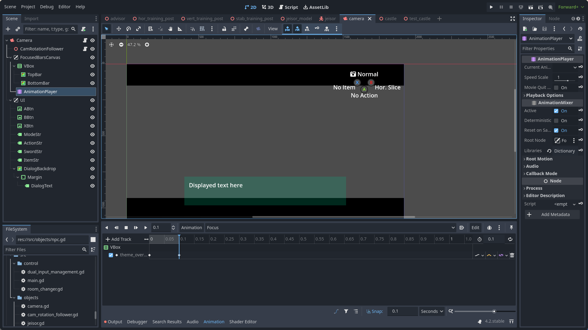
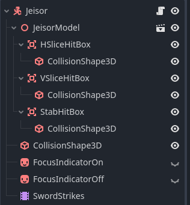
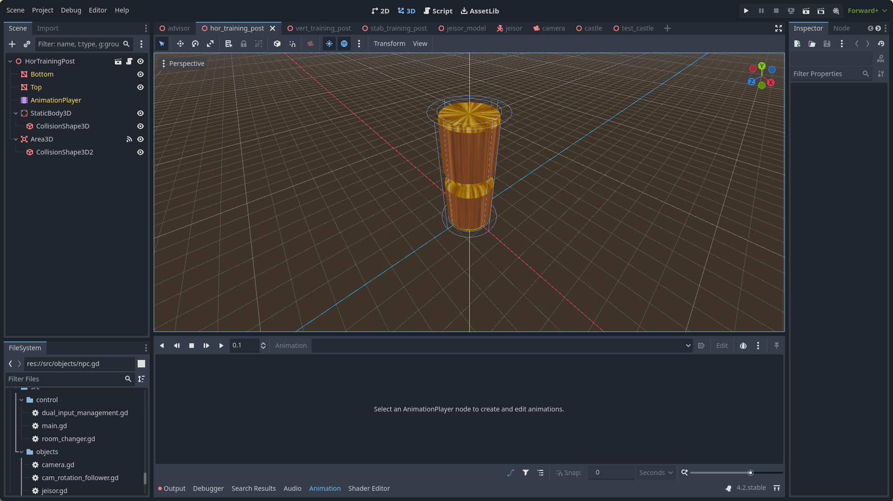
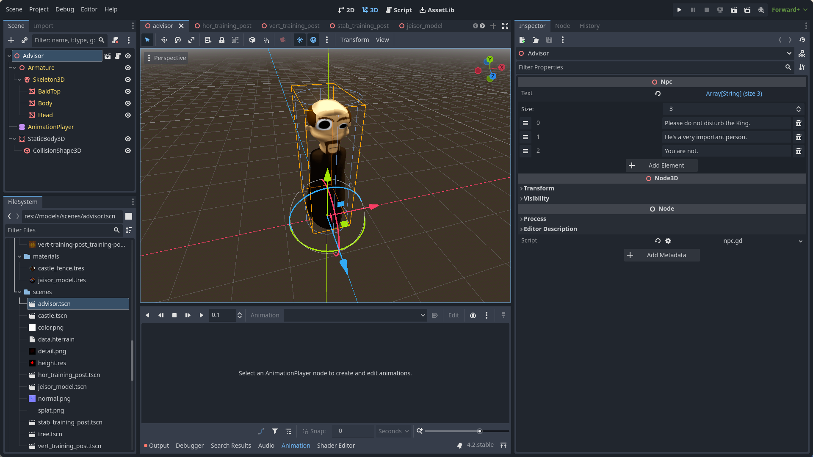

# Jeisor Quest Camera system explanation

## Description

This file is to give an idea of how to look through the code for the Zelda-like camera system of JeisorQuest.

It's not perfect, and there's a lot of interconnected stuff, so it's not easy to understand, but I can at least give an idea.

## File Explanations

- `camera.gd` - this goes to your main camera and has an export to talk to your player
- `camera_rotation_follower.gd` - this is a child of the main camera
- `targetable.gd` - this is a base class for z-targetable objects used in the main player script to find all targetable objects for checking if they're close or not
- `training_post.gd` - a targetable object that can be split horizontally, vertically, or stabbed through
- `npc.gd` - a special kind of targetable object that holds text info to start the dialog system
- `jeisor.gd` - the player code
   + Camera state updating
   + Movement
   + Different kinds of slashes
   + Etc.

## Objects

- Camera
   + Camera object w/ `camera.gd` is a Camera3D
   + It has a Node3D child call CamRotationFollower
   + It has a CanvasLayer for Focus Bars as well as one for dialog UI and action icons

   
- Jeisor
   + All the physics things you'd expect from a character

   
- Horizontal Training Post (Targetable that can be cut through with the horizontal slash)

   
- Advisor (NPC)

   

